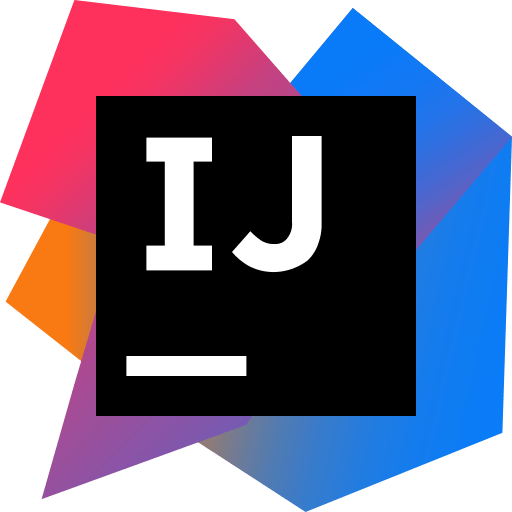
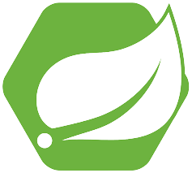

Welcome to my github page. I created this page to store any new projects that I wanted to start working on by myself and so that I can, one day, look back on how I have been improving.

---

### About me

### Tools
|VSCode|IntelliJ|GIT|PostGres|
|---|---|---|---|
|  |  |  |  | 
| &#9733; &#9733; &#9733; &#9733; &#9733; &#9734; | &#9733; &#9733; &#9733; &#9733; &#9734; &#9734; | &#9733; &#9733; &#9733; &#9733; &#9734; &#9734; | &#9733; &#9733; &#9733; &#9733; &#9734; &#9734; | 
### Languages

|Java|Javascript|CSS|HTML|Python|SQL|
|---|---|---|---|---|---|
|  |  |  |  | |  |
| &#9733; &#9733; &#9733; &#9733; &#9733; &#9734; | &#9733; &#9733; &#9733; &#9733; &#9734; &#9734; | &#9733; &#9733; &#9733; &#9733; &#9734; &#9734; | &#9733; &#9733; &#9733; &#9733; &#9734; &#9734; |&#9733; &#9733; &#9733; &#9734; &#9734; &#9734; | &#9733; &#9733; &#9733; &#9733; &#9734; &#9734; |

### Frameworks
|Svelte|Vue|Spring|
|---|---|---|
|  |  |  |
| &#9733; &#9733; &#9733; &#9733; &#9734; &#9734; | &#9733; &#9733; &#9733; &#9734; &#9734; &#9734; | &#9733; &#9733; &#9733; &#9733; &#9734; &#9734; |

### Theory

|Algorithms|Structures|Patterns|
|---|---|---|
|  |  |  |
| &#9733; &#9733; &#9733; &#9733; &#9734; &#9734; | &#9733; &#9733; &#9733; &#9733; &#9734; &#9734; | &#9733; &#9733; &#9733; &#9734; &#9734; &#9734; |

### 2D Game Development
|Unity|Godot|
|---|---|
|  |  |
| &#9733; &#9733; &#9733; &#9734; &#9734; &#9734; | &#9733; &#9733; &#9733; &#9733; &#9734; &#9734; |

---

### Projects

Below I will list every project that I am working on, as I start them. When I finish a project, it will be updated accordingly. No advanced explanation will be provided, but you can check out the corresponding repository for documentation of said project.

> ### 2D Pathfinding
> 
> | Started | Finished | Happiness |
> | --- | --- | --- |
> | 04/03/2022 |  |  |

---

### Goals

- [ ] Get better at everything
- [ ] Get better at everything